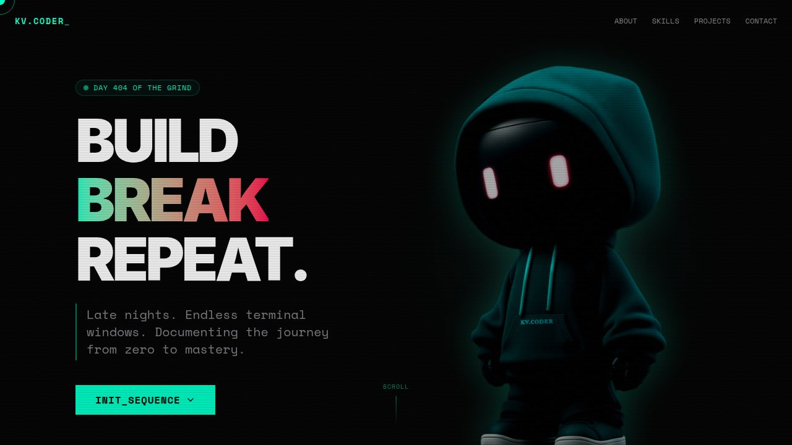

# KV.CODER Portfolio

Professional portfolio website for **Kalpesh Kurbetti**, an aspiring software developer and BCA student from Nipani, Karnataka. The site is built as a fast, responsive React single-page app with polished motion, theme switching, project previews, and contact actions.



## Live Demo

**Portfolio:** https://itskv-portfolio.netlify.app/

If the link is not live yet, GitHub Pages may still be deploying from the latest workflow run.

## Highlights 

- Modern responsive portfolio UI
- Dark and light mode support
- Animated preloader, page transitions, and scroll progress
- Smooth navigation between profile sections
- Interactive project modal for featured work
- Copy-to-clipboard email button with toast feedback
- Contact links for phone, Instagram, GitHub, and LinkedIn
- Optimized Vite build for static deployment

## Tech Stack

| Area | Tools |
| --- | --- |
| Framework | React, TypeScript, Vite |
| Styling | Tailwind CSS |
| Animation | Framer Motion |
| UI | Radix UI, Lucide React, Sonner |
| Package Manager | pnpm workspace |
| Deployment | GitHub Pages |

## Sections

- Hero introduction
- About profile
- Education
- Technical skills and tools
- Featured project: Study Notes Website
- Contact and social links

## Project Structure

```text
.
+-- artifacts/
|   +-- portfolio/
|       +-- public/
|       |   +-- favicon.svg
|       |   +-- opengraph.jpg
|       +-- src/
|       |   +-- assets/
|       |   +-- components/
|       |   +-- lib/
|       |   +-- App.tsx
|       |   +-- index.css
|       |   +-- main.tsx
|       +-- index.html
|       +-- package.json
|       +-- vite.config.ts
+-- attached_assets/
+-- package.json
+-- pnpm-lock.yaml
+-- pnpm-workspace.yaml
```

## Local Development

Install dependencies:

```bash
corepack enable
pnpm install
```

Start the development server:

```bash
pnpm dev
```

Run TypeScript checks:

```bash
pnpm typecheck
```

Build for production:

```bash
pnpm build
```

Preview the production build:

```bash
cd artifacts/portfolio
pnpm serve
```

## Deployment

The repository includes a GitHub Actions workflow for GitHub Pages. On every push to `main`, it:

1. Installs dependencies with pnpm
2. Builds the Vite app with `BASE_PATH=/kv-portfolio/`
3. Uploads `artifacts/portfolio/dist/public`
4. Publishes the site to GitHub Pages

Production output:

```text
artifacts/portfolio/dist/public
```

## Author

**Kalpesh Kurbetti**  
Nipani, Karnataka, India  

- Email: kurbettikalpesh2003@gmail.com
- GitHub: [itskalpesh](https://github.com/itskalpesh)
- Instagram: [kv.coder](https://www.instagram.com/kv.coder/)
